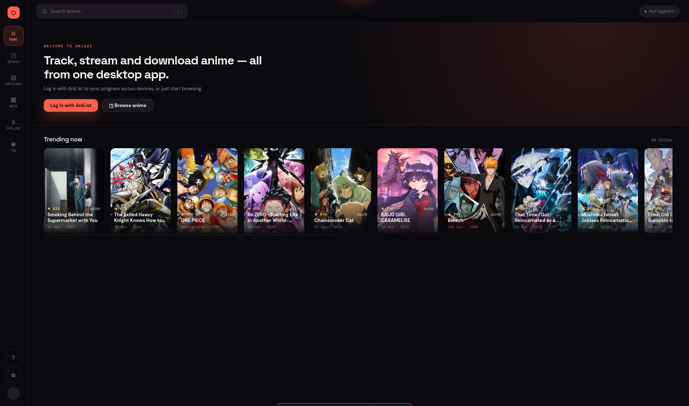
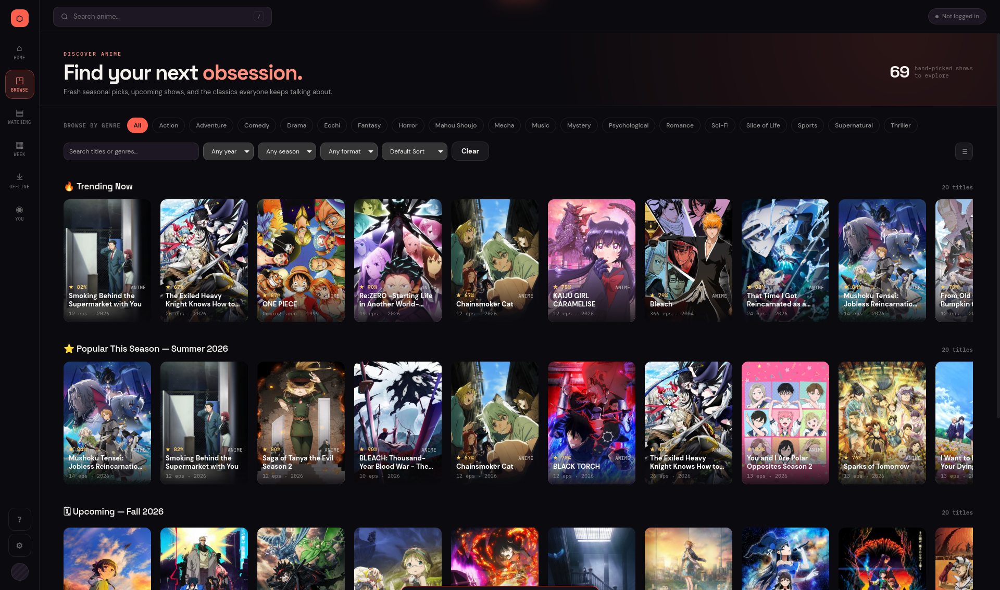
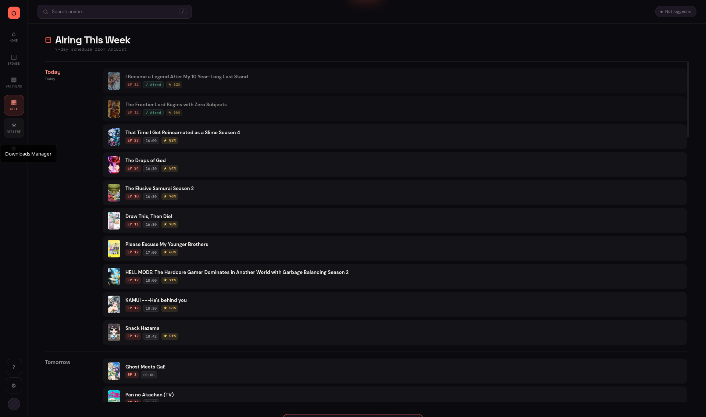
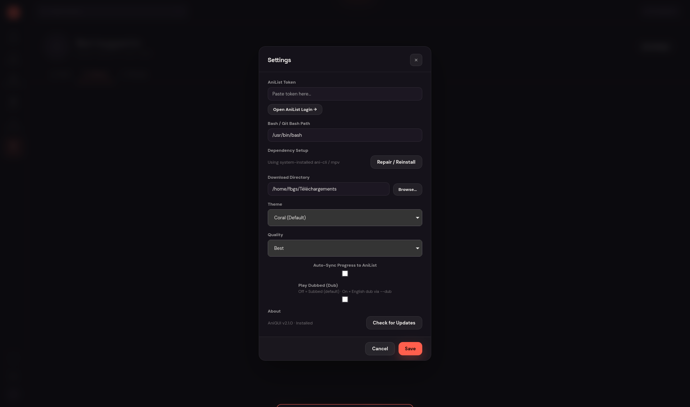

# AniGUI 🌸

AniGUI is a desktop anime companion app that pairs the lightning-fast CLI streaming of `ani-cli` with a modern graphical interface — and a player that behaves like the streaming apps you're used to.

Built with Tauri 2 and Rust, AniGUI lets you browse trending anime, watch episodes on your desktop with Netflix-style **Skip Opening / Next Episode** buttons, and automatically sync your progress with your AniList account.

**Jump to:** [Install on Windows](#windows) · [Install on Linux](#linux) · [Features](#features) · [Settings](#settings) · [Build from source](#building-from-source)

<a id="features"></a>

## ✨ Features

### Watching

- **A modern player interface:** AniGUI's bundled `mpv` ships with [uosc](https://github.com/tomasklaen/uosc) — a clean, themed control bar with a timeline, menus, subtitle/audio pickers, and previous/next-episode buttons, in AniGUI's coral colours.
- **Netflix-style buttons:** A clickable **Skip Opening** button appears during the opening, and **Next Episode ▶** during the ending (or the final credits when no skip data exists). Powered by [AniSkip](https://api.aniskip.com). `Tab` does the same thing from the keyboard.
- **Next / previous episode from the player:** Press `>` / `<` or use the buttons — no need to go back to the app.
- **Autoplay:** When an episode plays through to its end, the next one starts automatically (can be turned off).
- **Opens fullscreen:** The player launches fullscreen by default (can be turned off).
- **Exact-second resume:** Reopen an episode and it picks up from the exact second you left off.
- **Lightning-fast playback:** Episodes stream via `ani-cli` straight into `mpv`.

### Keeping your list in sync

- **Smart auto-sync:** Connect your AniList account and AniGUI updates your progress when you finish an episode. An episode counts as watched when you reach the ending (detected with AniSkip) **or** when you click Next Episode. Opening an episode and closing it early never counts.
- **Live refresh:** The detail page updates the moment a sync lands — progress bar, "Play EP n" button, and watched chips.
- **Local watch-history stats:** Episodes watched, approximate hours, most-rewatched show, and a top-genres breakdown — plus one-click CSV export.
- **Bulk list management:** Multi-select shows and move a batch between lists, mark a whole season watched, or reshuffle your Planning list.

### Discovering

- **Cinematic UI:** An icon rail replaces the old tab bar, Home greets you with a full-bleed banner of what you're mid-episode on, and a dark theme runs through every screen.
- **Real-time catalog:** Trending, highly-rated, and upcoming anime straight from AniList, plus instant search across the whole database.
- **Advanced browse filtering:** 18 genres with multi-select, plus year, season, format, and sort order.
- **Related media:** Jump to prequels, sequels, spin-offs, and movies from any detail page.
- **Weekly airing calendar:** See what airs in the next 7 days.
- **6 color themes:** Coral (default), Purple, Crimson, Ocean, Emerald, and Monochrome.

### Setup & offline

- **Zero-setup install (Windows and Linux):** No Scoop, no terminal, no manual `ani-cli`/`mpv` install — AniGUI downloads its own private runtime on first launch and runs everything without popping a console window.
- **In-app updates:** AniGUI checks GitHub Releases on launch and shows an **Update Now** banner when a new version is out. Updates are cryptographically signed and verified before they're installed. (Also available from **Settings → Check for Updates**.)
- **Download queue:** Queue multiple episodes; they download one at a time in the background with live progress and automatic retry.

## 📸 Screenshots

| Home | Browse |
|---|---|
|  |  |

| Airing This Week | Settings |
|---|---|
|  |  |

## 🚀 Installation

Every tagged release publishes builds for **both Windows and Linux** — check the **[Releases](https://github.com/fbgs006/ani-gui/releases)** tab. Pick your platform below.

**On this page:** [Windows](#windows) · [Linux](#linux) ([AppImage / .deb / .rpm](#linux-get-anigui) · [install dependencies yourself](#linux-manual-dependencies)) · [Windows manual/Scoop setup](#windows-manual-setup) · [Build from source](#building-from-source)

### Windows

No prerequisites — just download and run.

1. Download `AniGUI-setup.exe` (installer) or `AniGUI-Portable.exe` (portable, no installation needed).
2. Run it. On first launch, AniGUI downloads its own private copy of `ani-cli`, `mpv`, `fzf`, and a portable Git Bash into `%APPDATA%\AniGUI\runtime\` (~150-200MB, one time only). It also fetches the player interface (uosc, ~8MB) into the bundled `mpv`. Nothing is added to your system PATH.

AniGUI updates itself from here on — v2.2.0 is the first version with working in-app updates, so if you're on an older one, download it manually once.

Updating from an older version? The player interface is downloaded automatically in the background the first time you launch the new version.

Already have `ani-cli`/`mpv`/Git Bash installed and want AniGUI to use those instead? Click **"I already have these installed — skip"** on the setup screen, or set the path manually later (see [Settings](#settings)). Prefer to manage everything yourself? See the [manual / Scoop setup](#windows-manual-setup).

> **Heads up:** the new player interface and its buttons live in AniGUI's *bundled* `mpv`. If **Bash / Git Bash Path** is set in Settings, AniGUI uses your own `mpv` instead and leaves its config untouched — clear the field to get the AniGUI player.

### Linux

<a id="linux-get-anigui"></a>

**1. Get AniGUI** — pick whichever you prefer:

| Method | What to do |
|---|---|
| **AppImage** (any distro, incl. Arch) | Download the `.AppImage` from Releases, then `chmod +x AniGUI-*.AppImage && ./AniGUI-*.AppImage` |
| **.deb** (Ubuntu/Debian) | Download the `.deb` from Releases and install with `sudo apt install ./AniGUI-*.deb` |
| **.rpm** (Fedora) | Download the `.rpm` from Releases and install with `sudo dnf install ./AniGUI-*.rpm` |
| **Build from source** | See [Building from Source](#building-from-source) below — useful on Arch since there's no native `.pacman` package, or if you want the latest unreleased code |

**2. Launch it.** Same as on Windows: on first launch AniGUI downloads its own private copy of `mpv`, `fzf`, and `ani-cli` into `~/.local/share/AniGUI/runtime/` (~150-200MB, one time only), plus the player interface (uosc). Nothing is installed system-wide and no `sudo` is needed. It uses your system `bash`, and works on x86_64 and ARM64 (aarch64).

The one thing it can't provide is the small system tools `ani-cli` itself calls (`curl`, `tar`, `grep`, `sed`). Ubuntu ships all of these except sometimes `curl`: `sudo apt install curl` if the setup reports a problem.

<a id="linux-manual-dependencies"></a>

**Prefer your distro's packages?** Click **"I already have these installed — skip"** on the setup screen (or install these first and AniGUI won't ask):

Arch (and Arch-based distros):
```bash
sudo pacman -S mpv
yay -S ani-cli          # or paru, or any AUR helper
```

Ubuntu / Debian:
```bash
sudo apt install mpv
git clone "https://github.com/pystardust/ani-cli.git"
sudo install -Dm755 ani-cli/ani-cli /usr/local/bin/ani-cli
```

<a id="windows-manual-setup"></a>

### Advanced: manual / Scoop-based setup (Windows)

If you'd rather manage `ani-cli` and `mpv` yourself instead of using AniGUI's bundled runtime:

```powershell
Set-ExecutionPolicy -ExecutionPolicy RemoteSigned -Scope CurrentUser
Invoke-RestMethod -Uri https://get.scoop.sh | Invoke-Expression
scoop install git mpv ani-cli
```

Then in AniGUI's **You → Settings** (⚙ in the icon rail), point **Bash / Git Bash Path** at your own `bash.exe` (e.g. `C:\Program Files\Git\bin\bash.exe`) — an explicit path here always overrides the bundled runtime. You can re-trigger the bundled setup at any time from **Settings → Dependency Setup → Repair / Reinstall**.

<a id="building-from-source"></a>

## 🛠️ Building from Source

Building from source works the same on every OS: clone, install deps, run the Tauri CLI. Linux just needs a few extra system packages first (Windows and macOS don't).

**1. Install the toolchain:**
- [Node.js](https://nodejs.org/) (v18+)
- [Rust](https://rustup.rs/)

**2. Linux only — install Tauri's system dependencies:**

Arch:
```bash
sudo pacman -S --needed webkit2gtk-4.1 base-devel curl wget file openssl \
  appmenu-gtk-module libappindicator-gtk3 librsvg xdotool
```

Ubuntu / Debian:
```bash
sudo apt-get install -y libwebkit2gtk-4.1-dev libappindicator3-dev librsvg2-dev \
  patchelf build-essential curl wget file libxdo-dev libssl-dev
```

**3. Clone and run:**

```bash
git clone https://github.com/fbgs006/ani-gui.git
cd ani-gui/anigui-tauri
npm install
npm run tauri dev      # launches the full app in dev mode with hot reload
```

**4. To produce an installable build instead of dev mode:**

```bash
npm run tauri build
```

This puts a native installer/portable build under `src-tauri/target/release/bundle/` — an `.AppImage`/`.deb` on Linux, an `.exe`/`.msi` on Windows.

> Frontend-only iteration: `npm run dev` starts just the Vite dev server (no Tauri window, no Rust). `npm run build` runs `tsc` + a Vite build without producing a native app. Useful for quick UI work, but you need `npm run tauri dev` to actually exercise playback/downloads since those are Rust commands.

## 🧭 Using AniGUI

The left rail is your nav: **Home** (continue watching + plan-to-watch, or trending if you're not logged in), **Browse** (trending/seasonal/all-time, filterable by genre/year/format), **Watching** (jumps straight to whatever you're mid-episode on), **Week** (7-day airing calendar), **Offline** (downloaded files + the active download queue), and **You** (your AniList profile — Stats, History, and Manage).

### Keyboard shortcuts

Press **?** anytime for the full list.

| In AniGUI | |
|---|---|
| `/` or `F` | Focus search |
| `H` `B` `W` `C` `P` `D` | Home · Browse · Watching · Calendar · Profile · Downloads |
| `Space` | Play next episode |
| `Esc` | Close overlay / go back |

| In the player (mpv) | |
|---|---|
| `Tab` | Skip opening / ending (or click the on-screen button) |
| `>` / `<` | Next / previous episode |

<a id="settings"></a>

## ⚙️ Settings

Click **You → Settings** (or the ⚙ icon at the bottom of the rail):

1. **AniList Token** — Click **Open AniList Login →** to get your token. Paste it here to enable sync, Home's continue-watching row, and bulk list management.
2. **Bash / Git Bash Path** (Windows) — Leave blank to use AniGUI's bundled runtime (recommended, and required for the AniGUI player interface), or point it at your own `bash.exe` to use a system-installed `ani-cli`/`mpv` instead.
3. **Dependency Setup** (Windows) — Shows whether AniGUI is running on its bundled runtime or a system install, with a **Repair / Reinstall** button if something goes wrong.
4. **Download Directory** — Choose where downloaded episodes are saved (defaults to `Downloads/AniGUI`).
5. **Quality** — Preferred stream quality.
6. **Auto-Sync** — Toggle on to silently sync progress when you finish an episode. Leave off for a confirm prompt each time.
7. **Autoplay Next Episode** — Start the next episode when one plays to the end.
8. **Open Player in Fullscreen** — Launch `mpv` fullscreen.
9. **Play Dubbed** — Use the English dub instead of subs.
10. **Theme** — Pick your preferred color theme.

## 🏗️ Architecture

| Layer | Technology |
|---|---|
| Frontend | TypeScript (modular — views/, components/), Vanilla CSS |
| Backend | Rust (Tauri 2) |
| Runtime bootstrap (Windows only) | Downloads a private `ani-cli`/`mpv`/`fzf`/Git Bash/uosc into `%APPDATA%\AniGUI\runtime\` (`src-tauri/src/bootstrap.rs`) |
| Streaming | `ani-cli` via a `bash` shell command (spawned window-free) |
| Player | `mpv` + uosc, with two Lua scripts: a resume/progress tracker and the AniGUI controls (`src-tauri/lua/anigui-controls.lua`: skip/next buttons, episode navigation, autoplay) |
| Anime Data | AniList GraphQL API |
| Skip Detection | AniSkip API |

**How next/previous episode works:** each episode is its own `ani-cli` run, so the player script leaves a small request file and quits `mpv`; the backend reads it and relaunches the target episode, reporting each episode it played so progress and history stay accurate.

**Frontend module structure:**
```
src/
├── main.ts              ← Boot & Tauri event wiring
├── types.ts / state.ts / utils.ts
├── components/          ← toast, sync-bar, settings, shortcuts, download-queue, runtime-setup, updater
└── views/                ← home, browse, detail, downloads, calendar, profile
    (each paired with its own .css file)
```

**CI/CD:**
- Every push runs `npm run build` + `cargo check` on `windows-latest` as a fast correctness gate.
- Every tag push (`v*`) builds full release bundles on **both** `windows-latest` and `ubuntu-22.04`, signs them, and publishes them — plus the `latest.json` the in-app updater reads — as a draft GitHub Release. Signing needs the `TAURI_SIGNING_PRIVATE_KEY` repository secret (the matching public key is in `tauri.conf.json`).

---

*Note: This project is a collaboration between Human and AI. The Human (creator) acts as the Director and Project Manager — generating ideas, making design decisions, and finding issues — while the AI acts as the Lead Developer, writing code, building features, and fixing bugs.*

*Disclaimer: AniGUI is a graphical wrapper for ani-cli. It does not host or store any copyrighted video material.*
